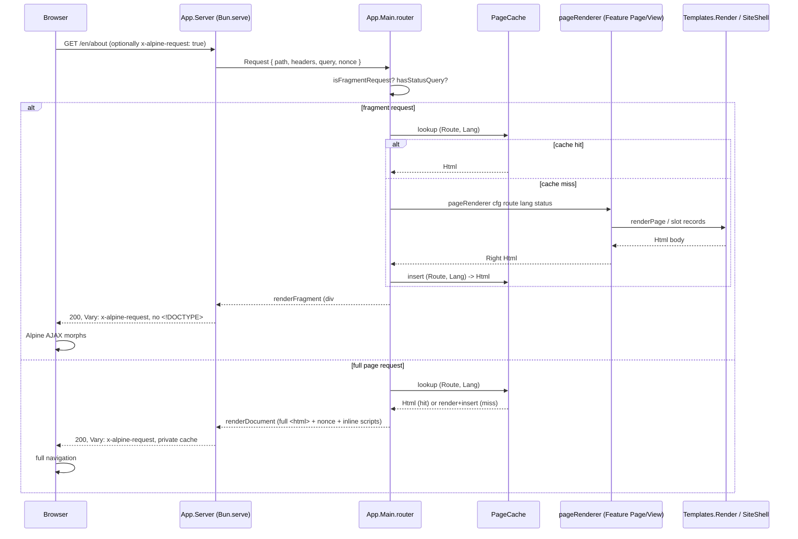

# Pohjola stack deep audit

**Scope:** read-only. `make gate`, `make test`, `make design-policy`, `make format-check` were run against a clean checkout (`b16d325`) after `bun install`; all four passed (gate 21/21, test 242/242). No code was changed.

## Executive summary

- The enforcement chain is real, not aspirational: `Policy.Contract` → `Test.Gate` → `ContractSpec` forms one closed loop, and every claim in `docs/GUARANTEES.md` maps to a specific check I could run and did run. This is unusually honest for a framework README — it names its own exemptions (streaming shell, `el`/`Tag` scan holes, FFI marshalling exemption) instead of hiding them.
- The MPA + Alpine-AJAX-fragment model is internally consistent: full page and fragment share one cache key `(Route, Lang)`, one `Vary` header, one error path. `handleFragment`/`failureFragment` exist specifically because an earlier version leaked a full `<!DOCTYPE>` document into a fragment swap (git history shows this bug fixed twice, W1 and a second occurrence in `routeMiss404`). That's a real fragility class the tests now pin.
- The template-slot system (`Landing`/`Editorial`/`Hub`/`Feed`/`Article`/`Schedule`/`Form`) is the framework's best agent-ergonomics idea and its worst scaling cliff at once: fixed-arity records (`HubCardTriple`, `ValueSextuple`, `FeatureTriple`) prevent utility-class soup, but a 4th hub card or a 7th value item is a breaking type change, and the array-to-fixed-arity adapters (`valuesSlotsFromArray`, `imageTripleFromArray`) **silently degrade to blank content** on a length mismatch instead of failing loudly (`src/App/Ui/Templates/Types.purs:343-368`) — a real hole in the "compiler is the contract" story.
- Doc debt exists but is small and mostly self-aware: `docs/AGENT_CONTEXT.md` is a one-line stub telling agents not to read it; `llms.txt` still lists a `App.Ui.Hero` primitive that does not exist in the closed `uiPrimitiveModules` set or anywhere in `src/` (`llms.txt:15,34` vs `src/Policy/Contract.purs:170-185`). Otherwise the doc graph is unusually current — several recent commits exist solely to re-align docs/comments with the checks (`cb87d40`, `d0237ff`, `dc35979`).
- `AGENTS.md` at 47 lines is close to ideal onboarding cost for a "safe first PR": it fits in one screen, states the safety floor, and routes everything else through a one-row-per-task table into `docs/`. The risk is the opposite direction — the table is a promise that must stay in sync with the docs it points to, and one row (`auth → ADR-002, do not code`) is doing real enforcement work that only the `make gate` "no forbidden auth imports" check actually backs up.
- Three ADRs (`ADR-002` auth, `ADR-004` sessions, `ADR-005` CSRF) are "Accepted — implementation pending," which is an unusual and useful status: it fixes the *shape* future agents must converge on before anyone needs it, precisely to avoid the "10 auth wrappers" problem the ADR names explicitly. `ADR-010` (browser islands) is explicitly "Proposed — do not implement," and `App.Auth.Scaffold` is fenced off by a gate check (`isForbiddenAuthImport`) rather than merely a comment — an actual example of AGENTS.md prose backed by a mechanical check.
- Route codecs per language (`src/Data/Route.purs`) are the right trade for a 3-language, 6-route app; the "one `routeCodec` function per language, everything else derived" shape is elegant now and the honest risk is `routeTable`/`allRoutes`/`prefetchFor` all being hand-enumerated `case`-per-constructor lists that grow linearly and untestedly with route count — bearable at 6 routes, a real tax past ~30.
- FFI allowlist (4 modules) is a real boundary, not a paper wall: `make gate` scans `src/` for `foreign import` outside the 4 files, and `ContractSpec` separately pins that `Policy.ffiAllowlist` still lists exactly those 4 — but the allowlist's own doc (`GUARANTEES.md`) is honest that `App.Bun` can grow indefinitely without a new ADR, which is a deliberately chosen and clearly-labelled soft spot, not a hidden one.
- Evals (`evals/evals/01`–`12`) read as regression fixtures pinned to the current template/gate contract, not as a live agent-shaping loop — there's no CI wiring visible for them and `evals/README.md` says as much ("Why not a sandbox?"). They are honest about being self-check tooling for a single-repo starter, not a Next.js-style baseline-vs-agents-md study.

## Architecture verdict

### Strengths

- **One render path, two shapes.** `App.Layout.Page.renderDocument`/`renderFragment` and `App.Ui.Templates.Render.renderPage` are both fed the same `Html` value produced by `pageRenderer` (`src/App/Main.purs:111-118, 220-240`). A route's body is computed once; only the wrapper differs. This is what makes the fragment/full-page cache-key sharing in `ContractSpec` ("full documents and fragments share page-cache keys") a property of the code, not a coincidence the tests happen to observe.
- **Errors as values, all the way to HTTP status.** `pageRenderer :: ... -> Aff (Either AppError Html)` threads through `cachedInner`/`cachedInnerDynamic`/`freshPage`/`failurePage`/`failureFragment` without a single `throw`. `errorStatus :: AppError -> Int` is a total function over a closed sum (`src/App/Main.purs:319-326`) — adding an `AppError` constructor forces every call site to decide its HTTP status, which is the actual mechanism behind the "no partial functions" guarantee, not just a style choice.
- **Cache correctness is deliberately over-engineered where it matters.** The dynamic cache key moved from `show route <> show lang` (a hand-written `Show` instance an agent could silently break) to the `(Route, Lang)` tuple itself, relying on derived `Ord` (`src/App/Main.purs:288-296`, and pinned in `ContractSpec`'s "dynamic cache keys cannot collide" block). Every response constructor's `Cache-Control` policy is derived from *why* the response exists (success/error/redirect-kind), not set ad hoc per call site — and `ContractSpec` specifically tests that a caller-supplied header cannot override it. That's real defense against a very common agent mistake (copy-pasting a cache header from one handler into another where it's wrong).
- **The Alpine seam is genuinely closed, with an honestly-documented crack.** `App.Alpine.Expr` is an unexported-constructor newtype and `Flag` is a closed sum, so no feature code can synthesize an Alpine expression by hand — verified by the compiler, not a scan. The scan-based half (attribute *names* must be built inside `App.Alpine`) is explicitly documented as evadable via `let k = "@click" in attr k …`, and `docs/conventions/alpine-contracts.md` says so in plain language instead of overclaiming. This is the single best piece of "honesty as a feature" in the repo.
- **Head-sync on fragment nav is a real, tested mechanism, not a hope.** `pageSyncAttrs`/`data-page-title`/`data-page-lang`/`data-page-href-*` are asserted present in every static route × every language in `ContractSpec`, and the inline sync script's exact call sites (`document.documentElement.lang=d.pageLang`, `meta[property="og:title"]`, popstate `restore`) are pinned as literal substrings. It is fragile in the sense that a rename anywhere in this chain requires a repo-wide grep (the doc says this explicitly), but it is not fragile in the sense of "untested magic."

### Weaknesses / scaling cliffs

- **Fixed-arity slot records don't scale past their arity, and their array adapters fail silently.** `HubCardTriple` is `{ one, two, three :: HubCard }`; `ValueSextuple` is six named fields; `imageTripleFromArray`/`valuesSlotsFromArray` pattern-match on an exact-length array and fall back to **empty-string placeholder content** on any other length (`src/App/Ui/Templates/Types.purs:343-368`). A 4th card or a 7th value silently renders blank fields instead of failing the build or even logging — this is the one place in the codebase where "compiler is the contract" quietly becomes "hope the array literal has the right length," and it is not covered by a gate/ContractSpec check the way almost everything else is.
- **Route enumeration is a parallel hand-maintained shadow of `Route`.** `allRoutes`, `staticRoutes`, `prefetchFor`, `routeTitle`, and `errorStatus`-adjacent dispatch in `Main.purs` are each their own exhaustive `case` over `Route`. The compiler forces exhaustiveness on each individually, but nothing forces an agent adding a route to remember all five sites at once beyond "does it compile" — which it will, with a possibly-wrong-but-total answer (e.g. forgetting to add a route to `staticRoutes` vs `cachedDynamicPage`'s route list compiles fine and just misroutes caching). This is exactly the class of bug the "exhaustive Route dispatch" ADR-013 story is meant to prevent, and it mostly does — but the number of independent exhaustive dispatches over `Route` (I count 6+ in `Main.purs` + `Route.purs` combined) is itself a maintenance surface that will get worse, not better, as routes grow.
- **`App.Bun` is a one-way ratchet with no growth check beyond code review.** `GUARANTEES.md` says adding a Bun primitive to the existing `App.Bun` module needs "a decode-at-boundary story and an ADR" but explicitly *not* a new allowlist entry, since the module is already listed. That's a reasonable design (a 5th FFI module is a bigger decision than a new function in an already-reviewed one), but it means the actual size of the FFI-trusted surface is unbounded by any mechanical check — it's bounded by review discipline alone, which the framework elsewhere refuses to rely on for anything else.
- **The head-sync/Alpine-contract chain has no single owner file.** `docs/conventions/alpine-contracts.md` itself says: "If you rename any of these, grep the whole repo: `App.Alpine`, `Main.purs`, `Layout/Page.purs`, and the inline head scripts all participate." Four independent files agreeing on `content`, `x-alpine-request`, `data-page-title` etc. by convention, tested only by string-literal assertions in `ContractSpec`, is workable at this scale and would be the first thing to crack under a 10×-feature fork, especially one that also changes the shell.
- **Two ADR-accepted-but-unimplemented domains (auth, sessions/CSRF) sit adjacent to a legacy scaffold that IS wired enough to compile.** `App.Auth.Scaffold` exists, is 118 lines, and is only kept out of `Main`/`Features` by a `make gate` substring check (`isForbiddenAuthImport`) — a real check, but one whose failure mode if ever weakened is "an agent wires in-memory sessions into production," which is precisely the scenario ADR-002 was written to prevent. The mitigation is real; the temptation it's guarding against is also real and sitting right there in the tree.

### Request → render → fragment swap

## Documentation & agent-instructions verdict

### Canonical map (what to read when)

| Need | Canonical doc | Notes |
|---|---|---|
| Safety floor / first orientation | `AGENTS.md` (symlinked as `CLAUDE.md`) | 47 lines, current, matches code (verified against `Policy.Contract` and `Main.purs`). |
| "Which doc for which task" | `AGENTS.md` task→doc table | Accurate for every row checked (page, chrome, Alpine, FFI, forms, tests, deploy, i18n, auth). |
| Page archetype choice | `docs/superpowers/specs/2026-08-31-page-architectures.md` | Best single doc in the repo — decision table + anti-pattern table + verification commands. |
| Alpine seam rules | `docs/conventions/alpine-contracts.md` | Honest about its own scan limitations; matches `App.Alpine` exactly. |
| Guarantees / enforcement claims | `docs/GUARANTEES.md` | Cross-checked against `make gate`/`make test` output; all clauses verified live. |
| ADR index | `docs/adr/README.md` | Accurate status column, including "implementation pending" and "do not implement" states — matches code. |
| Human-only setup | `docs/SETUP.md` | Correctly told to skip in `AGENTS.md`. |
| Generator/codegen contract | `docs/conventions/generators.md` | Matches `scripts/auto-scaffold.js` invocation and `Makefile` targets 1:1. |
| Quick agent cheat-sheet | `llms.txt` | Mostly accurate; **stale reference to `App.Ui.Hero`** (see below). |
| Superseded/legacy pointer | `docs/AGENT_CONTEXT.md` | Deliberately a 1-line "don't read this" stub — good hygiene once you know it's there, one wasted hop until you do. |

A new agent can reach the right doc for "add page," "chrome," "Alpine," "FFI," "forms," "deploy," and "new language" in **one hop** from `AGENTS.md`'s table — I verified all seven rows resolve to real, current files. That table is doing more load-bearing work than its size suggests; it is the actual doc-discovery mechanism for this repo, more than any index page.

### Redundant / stale / missing docs

- **`llms.txt` vs `Policy.Contract.uiPrimitiveModules`:** `llms.txt:15` and `:34` name `App.Ui.Hero` as a primitive/forbidden-import example. No `Hero.purs` exists anywhere in `src/`, and the closed `uiPrimitiveModules` list in `src/Policy/Contract.purs:170-185` has no `Hero` entry. This is genuine drift (the "hero" concept moved into `LandingHeroSlots` inside `Templates.Types`, not a standalone `App.Ui` primitive) and it's in the one doc explicitly optimized for LLM consumption — worth a one-line fix.
- **`docs/AGENT_CONTEXT.md`:** entirely a pointer ("Superseded by AGENTS.md. Do not load this file..."). It does its job, but it's a file whose only content is "don't read me," which costs a wasted tool call the first time any agent (or this audit) encounters it in a listing. Deleting it and letting a 404 speak for itself, or folding the one sentence into `AGENTS.md`'s header, would remove a hop without losing information.
- **`docs/archive/htmx-4-migration.md`:** correctly labelled "planning artifact, not active" and referenced only from `ADR-011`'s "if triggered" clause — this is the right way to keep historical research without it competing for attention. No action needed.
- **ADR-011 → ADR-010 tier reference:** `ADR-011-alpine-ajax-frozen-transport.md`'s interactivity-tier table names "Datastar island — ADR-010" at tier 5, but `ADR-010` itself is explicitly "Proposed — do not implement" and its own "Open questions" section leaves the client-runtime choice (Datastar vs. something else) undecided. An *accepted* ADR citing a specific runtime choice from a document that has explicitly not decided that choice is a small but real doc-consistency gap — not wrong exactly (ADR-011 is careful to say "explicit per feature"), but it reads as more settled than ADR-010 claims to be.
- **Duplication between `llms.txt`, `AGENTS.md`, `.cursor/rules/*.mdc`, and `docs/superpowers/specs/2026-08-31-page-architectures.md`:** all four state some version of "no `class_`/primitives in feature views, fill slots only." This is intentional defense-in-depth for different tools (Cursor rules vs. CLAUDE.md vs. LLM quick-reference vs. the deep spec) rather than accidental duplication, and all four were consistent with each other and with the gate at the time of this audit — but it is four places to keep synchronized for one rule, and the Hero drift above shows that synchronization isn't free.

### Proposed AGENTS.md diff (outline only)

No changes are strictly required — `AGENTS.md` is already close to the right size and shape. If revisiting it:

- Add one line under "Safety floor" naming the `Templates.Types` fixed-arity slot ceiling explicitly ("Hub/Feed/Editorial slot arrays are fixed-count records — check `Types.purs` before assuming a 4th/7th item is free"), since it's the one place an agent's mental model ("it's typed, it's safe") will be wrong in a way the compiler won't catch.
- Fix the `Hero` reference in `llms.txt` (not `AGENTS.md`, but same audience/purpose) so the "Do not import" list matches `uiPrimitiveModules` exactly.
- Consider deleting `docs/AGENT_CONTEXT.md` rather than keeping a stub — the same information fits as a footnote in `AGENTS.md` ("older `docs/AGENT_CONTEXT.md` is superseded and can be ignored") without costing a file read.
- No other row of the task→doc table needs correction; all seven checked resolved correctly.

## Agent ergonomics verdict

### How I would want to work here

Read `AGENTS.md` (47 lines), then the one doc named by the task-table row, then grep the named exemplar (`About` or `Posts`) before writing anything. That's roughly 150-250 lines of reading before a safe first PR for the common case ("add page"), which is low for a framework enforcing this many invariants. The reason it stays low is that the enforcement is mechanical rather than tacit: an agent doesn't need to *remember* "no `class_` in features," it needs to know that `make gate` will fail loudly and specifically if it forgets, and the failure message doubles as the reminder next time.

### Is it convoluted? (yes/no + nuance)

**No, with one real exception.** Every piece of ceremony I traced back to a specific, nameable defect the codebase had already shipped and fixed (the fragment/full-page nesting bug appears twice in different call paths before being closed by tests; the cache-key collision risk from a hand-written `Show` instance; the `Cache-Control` override bug fixed identically for three response families). This is the opposite of cargo-culted architecture — the comments in `ContractSpec` and `Main.purs` narrate the actual incident each check exists to prevent, dated and specific. The one exception is the fixed-arity slot records: `HubCardTriple`/`ValueSextuple`/`FeatureTriple`/`ImageTriple` read as premature ceremony (Why exactly three? Why exactly six?) with a silent-failure escape hatch bolted on, rather than the same "checked because we got burned" pattern everything else follows.

### Top 10 friction points (ranked)

1. **Fixed-arity slot records silently blank out on wrong array length** (`Types.purs:343-368`) — the single largest gap between the "compiler is the contract" story and reality; no gate/test currently guards it.
2. **`llms.txt` `Hero` drift** — small, but it's the file most likely to be a model's *only* context in a constrained agent setup, so its accuracy matters disproportionately.
3. **Six-plus independent exhaustive dispatches over `Route`** (`allRoutes`, `staticRoutes`, `prefetchFor`, `routeTitle`, `handleRoute`, `fragmentHtml`) — each individually total, but nothing forces an agent to touch all of them together, so a new route can compile while being wrong (e.g., missing from `staticRoutes` while present in the static-page case of `handleRoute`, which would misfile it under the wrong cache).
4. **Four-file Alpine-contract chain held together by grep-discipline** (`App.Alpine`, `Main.purs`, `Layout/Page.purs`, inline head scripts) — documented, tested by string assertion, but genuinely fragile to a rename under time pressure.
5. **`App.Auth.Scaffold` sitting in the tree, wired-enough-to-compile, kept out only by a substring gate check** — the mitigation is real, but the shape of the mistake it prevents ("just import the scaffold, it compiles") is one keystroke away.
6. **`AGENT_CONTEXT.md` as a pure "don't read this" stub** — a wasted hop, not a wrong answer.
7. **ADR-011 citing a specific runtime (Datastar) from ADR-010, which explicitly hasn't decided that** — minor, but the kind of thing that reads as more settled than it is if an agent skims only ADR-011.
8. **Evals are not wired into CI** (no eval invocation visible in `.github/workflows`, confirmed by `evals/README.md`'s own framing as a self-check tool) — they encode "correct," but nothing currently fails a PR if an agent's implementation regresses eval-checkable behavior other than the conventions gate itself already catching.
9. **`App.Bun`'s growth is unaudited by any mechanical check** — bounded by ADR/review discipline alone, unlike almost every other boundary in the repo.
10. **Route-codec-per-language means adding the 4th language touches `Route.purs`, `I18n.purs`, `Head.purs`, and the fragment head-sync script** (per `docs/conventions/adding-a-language.md`'s own 4-item checklist) — small at 3 languages, a real multi-file tax already visible in the doc's own instructions.

### Top 10 things to keep unchanged

1. `Policy.Contract` as the single source of truth for every scan — no parallel JSON manifest, no drift between "gate" and "spec."
2. The `Aff (Either AppError Html)` shape threaded through every render path without exception.
3. `ContractSpec`'s habit of narrating the specific historical bug each assertion prevents, with the defect's shape spelled out in the comment.
4. The `(Route, Lang)` tuple cache key over any `Show`-derived string.
5. `docs/GUARANTEES.md`'s named-exemptions section — naming the streaming shell, the `el (`-scan hole, and the FFI marshalling exemption explicitly instead of pretending the guarantee is unconditional.
6. `App.Alpine.Expr`'s unexported constructor + closed `Flag` sum as the actual (compiler-enforced) half of the Alpine contract, with the scan-based half honestly labelled as the weaker half.
7. ADR status column discipline — "Accepted," "Accepted — implementation pending," "Proposed — do not implement" are meaningfully different and consistently applied.
8. `make new-feature ... WIRE=1` actually wiring `Route`, `Main`, `I18n`, and `Head` together and validating compilation immediately, rather than leaving wiring as a follow-up checklist.
9. The one-hop `AGENTS.md` task→doc table — every row I checked resolved correctly.
10. Fenced-off legacy code (`App.Auth.Scaffold`) via a gate check rather than a comment-only warning.

## Comparative lens

- **vs. Next.js/React SPA:** Pohjola buys back the hydration-mismatch class of bugs entirely (there is no client VDOM to reconcile against server output) and the JSON-duplication-of-domain-state problem the README names. It pays for this with a materially smaller ecosystem and no path to rich client-only interactivity without the not-yet-accepted ADR-010 island mechanism — a real gap for anything beyond forms/menus/theme.
- **vs. Rails/Django hypermedia:** the type system genuinely earns its keep beyond "types are nice" — the specific wins are exhaustive route/dictionary/error coverage at compile time and the closed `Html` ADT's centralized escaping, both of which are the actual mechanisms (not just marketing) behind clauses 4-7 of `GUARANTEES.md`. Rails/Django require discipline or a linter for the equivalent; Pohjola requires a compile.
- **vs. htmx:** the ADR-011 comparison table is unusually candid — it picked Alpine AJAX not because htmx is worse in the abstract, but because the current feature set (shell nav, menus, theme) doesn't yet need htmx's in-page-partial strengths, and it wrote down the exact trigger condition ("form submit → partial re-render with field errors inside a card") for when that stops being true. This is a defensible, revisitable choice rather than a philosophical commitment, which is the right posture for a decision like this.
- **"Compiler as contract," honestly assessed:** true for routing, i18n completeness, error-status mapping, and HTML escaping — false, or at least unenforced, for slot-array arity (finding #1 above) and for Alpine attribute *names* (openly documented as scan-only). A contributor who mostly touches `App.Features/*` will find the compiler genuinely blocks the mistakes AGENTS.md warns about (no `class_`, no raw HTML) but will not be caught by the compiler if they hand a 4-item array to a 3-slot builder — they'll get a blank card instead. The story is honest where the repo says it's honest (`GUARANTEES.md`'s exemptions section) and slightly oversold in exactly the one place (`Types.purs` array adapters) that isn't named there.

## Risk register

| Risk | Likelihood | Impact | Mitigation already in repo | Gap |
|---|---|---|---|---|
| Policy bypass (agent routes around `Policy.Contract`) | Low | High | Single source of truth scanned by both `Test.Gate` and `ContractSpec`; no parallel manifest to edit instead | Scan-based checks (Alpine attribute names, `el (` tag concat) are literal-text scans, documented as evadable by construction |
| CSP widening | Low | High | `ContractSpec` pins the exact CSP string, including the fallback CSP in the raw `.js` source; any change fails a named test | None significant — this is the best-covered risk in the repo |
| Fragment/cache bugs (full doc nested in `#content`) | Low (now) | Medium | Fixed twice historically, now covered by `ContractSpec`'s fragment-shape assertions for both success and error paths, across all routes/langs | New routes/handlers must remember to route through `fragmentHtml`/`failureFragment` rather than the full-page path; nothing forces this beyond code review + the existing tests catching it after the fact |
| Slot-array arity mismatch → silent blank content | Medium | Low-Medium | Fixed-arity types make the *common* case (correct count) unbreakable | `valuesSlotsFromArray`/`imageTripleFromArray` degrade silently on the wrong count instead of failing the build or throwing; no test currently exercises the mismatch path |
| i18n drift | Low | Medium | `allLangs`-driven dictionary is a compile error if any language is missing a key; route round-trip tested for every lang × route pair | Adding a language still requires 4 manually-coordinated edits per `adding-a-language.md`; nothing forces all 4 in one commit beyond the compiler eventually failing on the ones it can see |
| Generator drift (`auto-scaffold.js` diverging from hand-written conventions) | Low | Medium | `make generator-policy` validates the generator/`App.Ui` boundary and fixture idempotence; verified passing in this audit | Generator output quality for *new* template archetypes (beyond the 7 that exist) is untested by definition — each new archetype needs a new checklist row by hand |
| Agent doc drift | Low | Low-Medium | Recent commit history shows active doc/comment realignment (`cb87d40`, `d0237ff`, `dc35979`); AGENTS.md task table verified accurate | `llms.txt` `Hero` reference already drifted; no automated check cross-validates doc prose against `Policy.Contract`'s closed lists |
| AGPL fork friction | Medium (for private forks) | Medium | `AGENTS.md` explicitly instructs "do not paste private app names into this public tree" | This is a process control, not a mechanical one — nothing prevents an agent from doing it beyond the instruction being read |
| Bun/PureScript ecosystem risk | Medium (long-horizon) | Medium | Pinned exact versions everywhere (Bun 1.4, PureScript 0.15.16, Alpine 3.15.12, Alpine AJAX 0.12.7) with SHA256 asset verification | Small ecosystems move slower and have fewer maintainers; this is an accepted, not mitigated, risk inherent to the stack choice |
| Legacy `App.Auth.Scaffold` reaching production | Low | High if it happens | `make gate`'s `isForbiddenAuthImport` check specifically blocks importing it into `Main`/`Features` | Single check, single substring pattern; a sufficiently different import spelling or a future refactor that moves the check's logic could silently stop catching it — no dedicated test targets the check's own robustness beyond the gate passing today |

## Prioritized recommendations

| P | Effort | Recommendation | Rationale |
|---|--------|----------------|-----------|
| P0 | S | Make `valuesSlotsFromArray`/`imageTripleFromArray` (and any future array→fixed-arity adapter) fail loudly on a length mismatch — a compile-time-checked array literal at call sites, or at minimum a `Maybe`/`Either` return the caller must handle — instead of silently emitting blank placeholder content. | This is the one place the "compiler is the contract" claim doesn't hold; it's also the easiest to fix (it's a local pattern-match default, not an architectural change). |
| P0 | S | Fix the `App.Ui.Hero` reference in `llms.txt` to match the actual closed primitive set. | Costs one line to fix; costs a wrong mental model in exactly the doc most likely to be an agent's only context. |
| P1 | S | Delete or fold `docs/AGENT_CONTEXT.md` into a footnote in `AGENTS.md`. | Removes a guaranteed wasted hop for zero information loss. |
| P1 | M | Add a single test (in `ContractSpec` or a new `RouteCoverageSpec`) that asserts every `Route` constructor appears in `allRoutes` **or** is explicitly documented as excluded (dynamic routes), and similarly cross-checks `staticRoutes` against `handleRoute`'s static-vs-dynamic dispatch — turning "6 independent exhaustive dispatches, individually total" into one property that catches a route landing in the wrong bucket. | Closes the actual mechanism by which a new route could silently misroute caching while still compiling. |
| P1 | S | Soften the ADR-011 → ADR-010/Datastar tier-5 reference to match ADR-010's actual "Proposed, undecided" status, or accept ADR-010's client-runtime question specifically for the Datastar case if that's now the real intent. | Small, but it's the one spot where an accepted ADR reads more settled than the proposal it cites. |
| P2 | M | Consider a mechanical check (even a simple grep-based one in `make generator-policy`) that `App.Bun`'s FFI surface growth is at least logged/diffed per PR, given it's the one FFI boundary explicitly exempted from needing a new allowlist entry. | The only FFI growth path in the repo that relies purely on review discipline; a lightweight tripwire (not a hard gate) would match the rest of the repo's posture without over-constraining legitimate growth. |
| P2 | L | If a 4th language or a 10×-feature fork is actually on the roadmap, revisit the per-language `routeCodec` + 4-file head-sync chain before it happens, per `ADR-014`'s own framing ("until a private-fork merge conflict forces a split"). | The repo has already correctly deferred this rather than over-engineering early; flagging it as the concrete trigger condition to watch, consistent with the project's own stated deferral logic. |

## Open questions for the maintainer

1. Is the fixed-arity slot design (`HubCardTriple`, `ValueSextuple`) a deliberate ceiling meant to force a new `PageTemplate`/slot type rather than "just add a 4th card," or should the array adapters instead grow to handle arbitrary counts safely? Both are defensible; the current silent-blank fallback is the one state that isn't.
2. Is `evals/` intended to gain CI wiring at some point (per `evals/README.md`'s "Future CI integration" item), or is it staying a manual self-check tool indefinitely? That changes how much weight the eval suite should carry in the "verification ladder" story.
3. Given `App.Bun`'s explicitly-unbounded growth path, is there an appetite for even a lightweight tripwire (diff-size warning, required comment tag) short of a full ADR per addition — or is review discipline considered sufficient at current team size?
4. Is `ADR-010`'s Datastar mention in `ADR-011` intentional pre-commitment, or should `ADR-011` be loosened to not name a specific runtime until `ADR-010` itself is accepted?
